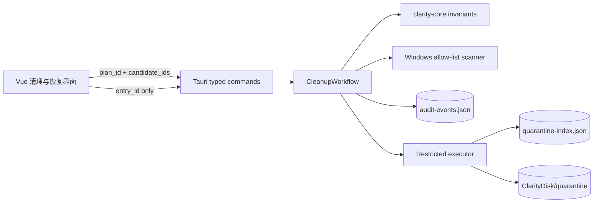

# 清理审计与受限隔离架构

> 状态：计划三受限基础版已实现 · 安全级别：普通用户受限写入 · 更新时间：2026-08-14

## 1. 范围

当前闭环为“规则发现 → 用户选择 → 不可变计划 → 新扫描复核 → 一次性确认 → 执行开始审计 → 隔离移动 → 结果审计 → 单项恢复”。真实写入仅开放 `user-temp.v1`，只把用户临时目录的安全直接子项移动到应用隔离区。

本阶段没有文件删除、管理员提权、Windows 服务控制、任意命令执行或分区写入。浏览器缓存、缩略图、回收站、构建缓存和 Windows 更新缓存仍是只读规则。

## 2. 信任边界

- UI 从不提交执行或恢复路径，也不能提交自定义规则、风险、容量或摘要。
- Rust 只接受当前计划中的候选 ID；未知、重复、空选择和过期计划均拒绝。
- 计划有效期 10 分钟，绑定来源卷、规则版本、路径、容量、项目数、风险、权限、恢复策略、隔离资格和元数据摘要。
- 申请确认与执行时各生成一次新扫描；新扫描 ID 和观测时间允许变化，所有执行相关字段必须相同。
- 只有规则 ID 为 `user-temp.v1`、无需管理员权限、恢复策略为 `Quarantine` 且允许隔离的候选可进入执行器。

## 3. 一次性确认协议

1. 后端使用操作系统加密随机数生成授权 ID 和 256 位令牌。
2. 挑战绑定后端保存的不可变计划与候选 ID，两分钟后失效。
3. UI 必须原样提交授权 ID、令牌，并输入精确确认词“确认移入隔离区”。
4. 执行入口在任何确认校验或文件系统工作前移除挑战，因此成功、错误、过期和部分失败都不能重放。
5. 新扫描复核后、任何文件移动前，必须先成功写入 `ExecutionStarted` 审计；写入失败则不移动文件。

令牌不接受路径、命令或操作类型，不能扩大到其他规则。报告中的 `execution_authorized = true` 仅说明这一笔受限请求消费了有效确认。

## 4. 隔离移动与恢复

- 隔离根固定为 `%LOCALAPPDATA%\ClarityDisk\quarantine`，执行器不接受 UI 提供的目录。
- 只枚举用户临时根的直接子项；路径必须是无 `.`/`..` 的绝对路径，既有祖先、候选根和完整子树均拒绝符号链接、联接点和重解析点。
- 每个子项先以 `Staging` 状态原子持久化原路径、隔离路径、容量、摘要和条目 ID，再调用同卷 `rename`。失败则转为未移动状态并计入跳过。
- 启动时核对遗留 `Staging`：仅当隔离来源存在且原位置不存在时认定为 `Staged`，否则保守回退，不猜测执行成功。
- 恢复命令只接收 `entry_id`，从后端索引读取路径；隔离来源必须仍在应用根内且整树无不安全间接项，目标父目录必须严格等于绝对 TEMP/TMP 允许根。
- 原位置存在时返回 `RestoreConflict`，不覆盖、不改名、不接受 UI 自选位置。

永久删除、批量恢复、自动保留期、跨卷复制和自选恢复位置尚未开放。

## 5. 本地持久化与审计

- 审计：`%LOCALAPPDATA%\ClarityDisk\state\audit-events.json`，最多 200 条，最新在前。
- 隔离索引：`%LOCALAPPDATA%\ClarityDisk\state\quarantine-index.json`，预演刷新会保留所有非预演恢复记录。
- 隔离内容：`%LOCALAPPDATA%\ClarityDisk\quarantine\<plan>\<candidate>\<entry>`。
- JSON 先写 `.tmp`，再用旧文件备份完成 Windows 兼容替换；替换失败时尝试恢复上一份有效文件。
- 损坏 JSON 安全返回空状态，不把不可信内容用于执行；恢复时仍会重新执行路径白名单校验。

审计事件覆盖扫描完成、计划生成/拒绝、索引预演、确认签发、执行开始/完成和恢复开始/结果。事件只记录类型、关联 ID、规则 ID、数量、容量、时间和安全原因，不记录文件内容。

## 6. Windows 更新缓存规则

`windows-update-download-cache.v1` 仍只扫描 `%SystemRoot%\SoftwareDistribution\Download`。它默认不选中、标记为 `ConfirmationRequired` 且未来执行需要管理员权限；当前不停止 Windows Update 服务、不调用清理命令、不请求提权，也不会进入受限执行器。

## 7. 后续前置条件

计划四在扩大规则范围前必须分别完成：Microsoft 官方接口适配、专用枚举协议、保留期与容量策略、跨卷恢复事务、永久删除安全评审和更多故障注入测试。任何高权限系统清理仍需独立受限服务设计，不能复用普通用户隔离令牌直接授权。
