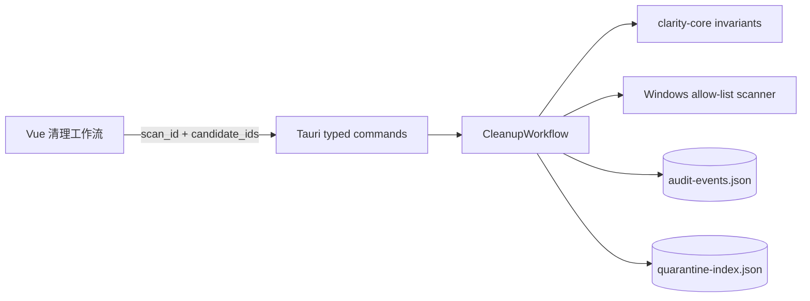

# 清理审计与隔离区预演架构

> 状态：计划二已实现 · 安全级别：只读 · 更新时间：2026-08-13

## 1. 范围

本阶段建立“规则发现 → 用户选择 → 不可变计划 → 审计 → 隔离区索引”的只读闭环。它没有文件删除、文件移动、管理员提权、Windows 服务控制或任意命令执行能力。

## 2. 信任边界

- UI 只能提交本次扫描返回的候选 ID，不能提交路径、规则、摘要或风险字段。
- Rust 从缓存的完整预览复制候选快照；未知、重复、空选择和旧 `scan_id` 均拒绝。
- 计划有效期为 10 分钟，绑定扫描 ID、来源卷、规则版本和元数据摘要。
- 隔离区索引只从当前已验证计划派生，并固定 `files_moved = false`。

## 3. Windows 更新缓存规则

`windows-update-download-cache.v1` 只扫描 `%SystemRoot%\SoftwareDistribution\Download`。规则为 `ConfirmationRequired`、默认不选中，并标记未来执行需要管理员权限。本阶段不停止 Windows Update 服务、不调用清理命令、不请求提权；目录不存在、访问被拒或不可读时，仅记录规则状态和安全原因。

## 4. 本地持久化

- 审计：`%LOCALAPPDATA%\ClarityDisk\state\audit-events.json`，最多 200 条，最新在前。
- 隔离区预演：`%LOCALAPPDATA%\ClarityDisk\state\quarantine-index.json`，只保留最新索引。
- 写入先编码到 `.tmp`，再以旧文件备份进行 Windows 兼容替换；替换失败时恢复上一份有效文件。
- JSON 损坏时返回空状态，不把不可信数据用于计划或后续执行。

审计仅记录事件类型、规则 ID、候选数量、容量、时间和安全原因，不记录文件内容。隔离区索引需要保存原始允许路径用于未来恢复校验，但只存储在本机，不上传。

## 5. 后续执行层前置条件

实现真实清理前仍必须增加：一次性确认令牌、独立受限特权协议、官方 Windows 清理接口、执行前重新发现、逐项结果审计、隔离区真实移动及冲突恢复。未完成这些条件前，`execution_authorized` 必须始终为 `false`。
