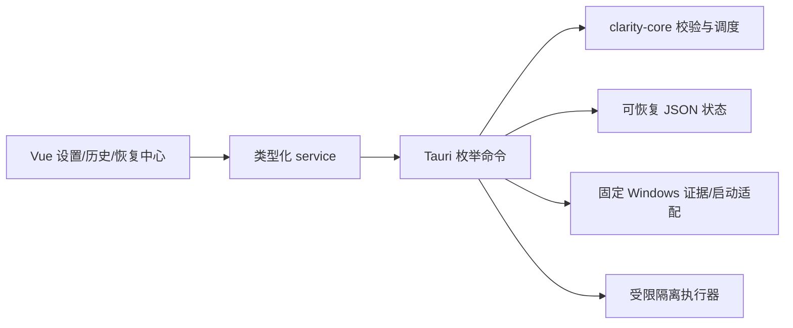

# 设置、自动维护、历史与更新架构

> 版本：1.0 · 日期：2026-08-17

## 1. 分层

- Vue 只提交设置 DTO、后端 entry ID 和恢复位置枚举。
- `clarity-core::settings` 验证 schema、固定隔离档位、忽略根数量与绝对路径形式，并以纯函数评估自动维护。
- Tauri 状态使用 `.tmp → backup → replace` 替换，不把损坏 JSON 当作有效设置。
- Windows 自动维护只读脚本固定读取空闲时间、电源和受支持的更新/备份进程，不接受调用方脚本或路径。
- 更新检查只访问 `https://api.github.com/repos/leaf-zly/clarity-disk/releases/latest`；响应 URL 必须仍属于该仓库。

## 2. 自动维护

自动维护是安全调度器，不是无人值守删除器。每 15 分钟的 tick 先判断周/月频率，再要求至少五分钟空闲、稳定供电、无 Windows 更新和备份活动。未知或发现失败不运行。到期时只调用现有 `CleanupWorkflow::scan`，形成候选和审计；执行仍需普通清理的一次性令牌与用户确认。

最后成功运行时间保存在 `automatic-maintenance.v1.json`。并发 tick 由互斥锁串行化，只有扫描和状态持久化都成功才更新时间。

## 3. 历史与隐私

活动页读取三个已有最小化存储：清理审计、空间扫描终态和管理员终态。筛选在内存完成，导出只包含当前可见脱敏行。自定义扫描根导出为“已脱敏扫描范围”，只有盘符根可以原样保留。

清除历史写入空数组，不删除隔离索引、分区恢复日志或崩溃诊断。崩溃诊断单独控制，只记录版本、时间、内部 Rust 源文件名/行号和固定分类，不记录 panic payload。

## 4. 恢复与永久删除

备用恢复目标是 `Original/Desktop/Documents/Downloads` 枚举。后端从 `USERPROFILE` 解析并使用 `Clarity Disk Restored` 子目录；不存在则创建，存在同名目标则进入冲突状态，绝不覆盖。

永久删除使用独立挑战，不复用清理确认：

1. 校验 1–100 个唯一 entry ID 和可删除状态；
2. 对当前持久化 entry 快照计算 SHA-256；
3. 签发两分钟随机令牌和固定确认词；
4. 消费令牌后重新加载并比较摘要；
5. 在文件系统边界前持久化开始审计；
6. 每项重新验证应用隔离根、路径链和整树重解析点；
7. 成功项进入 `PermanentlyDeleted`，失败项保留原状态；
8. 写入终态审计和释放字节。

## 5. 更新与发布

应用内只检查和展示官方 Release，不自行下载安装。完整的签名、哈希、安装/卸载和来源验证位于 GitHub Release workflow，避免普通进程重新实现 Windows 安装信任链。
