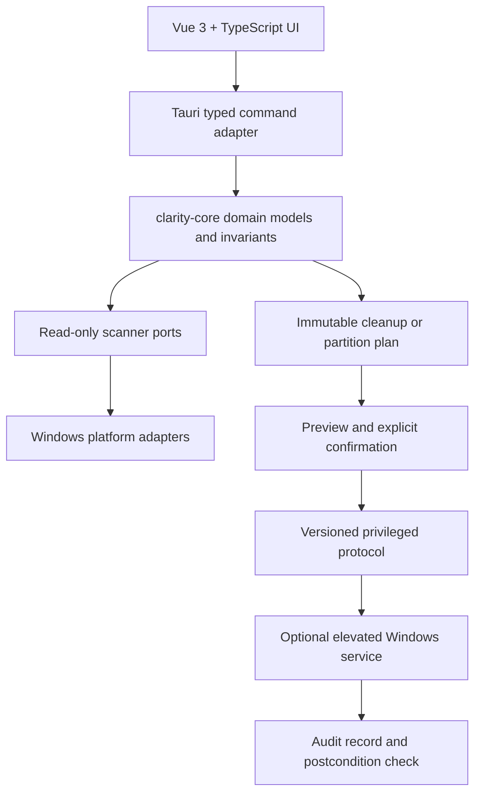
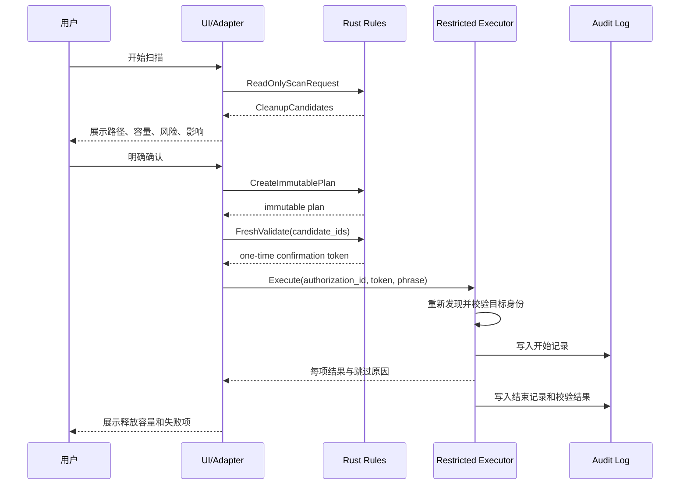

# 澄盘实现计划

> 文档版本：1.0 · 更新时间：2026-08-17 · 状态：核心工程能力已完成，危险能力按部署证据门禁

这份文档用于统一产品范围、技术路线和安全边界。当前仓库已完成 P0–P8 的工程范围，以及独立备份证据/可销毁 VHDX 实验环境、历史/设置/自动维护、更新/诊断/签名发布强化、隔离永久删除与受控目标恢复。真实分区写操作仍要求有效外部备份凭据、专用实验记录、签名证书和双重功能门禁；默认安装不会绕过这些部署证据。

## 1. 目标与非目标

### 目标

- 提供优雅、克制、接近 Apple 产品体验的 Windows 磁盘管家界面。
- 用 Rust 承担领域模型、扫描、规则引擎、操作计划和 Windows 平台适配。
- 用只读扫描建立可信数据，再由预览、确认、执行、校验和审计组成完整闭环。
- 将正式安装包和便携版限定在 GitHub Actions 的 Windows Runner 生成。
- 让普通用户可以安全清理系统垃圾，让高级用户能够预演分区调整风险。

### 非目标

- 第一阶段不实现任意路径递归删除。
- 第一阶段不实现 EFI、恢复分区、系统分区或 BitLocker 风险卷的写操作。
- 不接受任意 PowerShell、CMD 或 shell 字符串作为特权服务输入。
- 不承诺本地开发机生成安装包；本地只做质量检查和前端构建。

## 2. 产品分阶段路线

| 阶段              | 交付内容                                             | 写权限 | 完成标志                                         |
| ----------------- | ---------------------------------------------------- | ------ | ------------------------------------------------ |
| P0 基础架构       | workspace、领域模型、首页、CI/CD、发布规范           | 无     | CI 全绿，首页可评审                              |
| P1 真实只读发现   | 系统盘容量、卷标、挂载点、多磁盘列表                 | 无     | Windows Runner 测试通过，异常可恢复              |
| P2 空间扫描       | 目录索引、类型统计、增量进度、暂停/恢复/取消与历史   | 无     | 已完成；等待每次提交的 CI 持续验证               |
| P3 清理规则与预览 | 临时文件、浏览器缓存、回收站、缩略图、更新缓存等规则 | 无     | 已完成；规则证据、选择校验、审计和隔离索引齐备   |
| P4 低风险清理     | 隔离区/回收站、官方 Windows 清理接口、一次性确认令牌 | 受限   | 已完成；四类缓存可隔离，回收站使用 Shell API     |
| P5 高级系统维护   | 休眠文件、更新缓存、还原点等需确认的系统项           | 受限   | 已完成；独立一次性管理员代理与三类适配器         |
| P6 分区预演       | 分区拓扑、可移动空间、合并可行性检查、执行模拟       | 无     | 已完成；只读报告解释阻塞原因并生成非授权模拟布局 |
| F11 健康检测      | 物理盘状态、温度、寿命、错误与加密只读汇总           | 无     | 已完成；未知证据不推断健康，序列号只保留末四位   |
| P7 分区安全基础   | 威胁模型、不可变计划、系统证据、恢复状态与故障注入   | 无     | 已完成；真实写入能力和执行授权仍不存在           |
| P7.1 分区写实现   | 数据迁移、卷调整、恢复持久化、回滚保护               | 高风险 | 工程实现完成；备份/演练/签名上线门禁仍关闭       |
| P8 发布强化       | Authenticode、安装卸载验证、诊断、性能与来源证明     | 依功能 | 工程完成；正式 tag 必须提供签名证书              |
| P9 产品闭环       | 历史、设置、自动维护、更新、恢复中心                 | 受限   | 已完成；自动维护只读，永久删除使用一次性确认     |

原则：每个阶段都必须能独立发布；没有完成安全前置条件时，后续危险能力保持不可见或只读。

## 3. 技术架构



### 模块职责

- `crates/clarity-core`：跨平台类型、容量校验、风险等级、扫描结果、操作计划和状态机；不得依赖 Tauri、Vue 或 Windows API。
- `apps/desktop/src-tauri/src/disk_discovery.rs`：只读系统卷发现；后续拆分为 `platform/windows/`，避免平台代码扩散到 command 层。
- `apps/desktop/src-tauri/src/commands/`：仅负责序列化、鉴权上下文、取消信号和错误映射，不做路径判断或业务决策。
- `apps/desktop/src/services/`：前端 typed invoke、加载状态、错误提示和浏览器 fixture 适配。
- `apps/desktop/src/components/`：展示组件；不直接访问文件系统，不拼接特权请求。
- `docs/`：架构决策、安全协议、发布流程、测试策略和变更记录。

## 4. 清理实现计划

### 4.1 只读发现

1. 枚举逻辑卷并绑定稳定卷标识，而不是只保存用户可修改的盘符。
2. 读取总容量、可用容量、文件系统、卷状态和 BitLocker 状态。
3. 扫描根目录时默认跳过符号链接、联接点、重解析点、虚拟文件和正在使用的系统目录。
4. 所有扫描任务支持取消、超时、低优先级和最大深度限制。
5. 结果带有 `scan_id`、时间戳、扫描范围、规则版本和不完整标记。

### 4.2 规则引擎

规则输出统一为 `CleanupCandidate`，至少包含：

- 稳定 `rule_id` 和版本号；
- 规范化路径或官方 API 标识；
- 字节数、文件数、可恢复性；
- `Safe`、`Review`、`ConfirmationRequired` 风险等级；
- 证据、跳过原因和用户可读说明；
- 默认是否选中以及是否允许进入隔离区。

首批规则按风险从低到高：浏览器缓存、缩略图缓存、临时目录、回收站、应用构建缓存、Windows 更新缓存、休眠文件。用户文档、下载目录、桌面、项目源码和未知扩展名默认不选中。

### 4.3 清理执行闭环



任何步骤失败都停止后续高风险项目；低风险直接子项允许逐项跳过并如实返回“部分完成”，不能伪装为全部成功。`user-temp.v1`、`browser-cache.v1`、`thumbnail-cache.v1` 与 `build-cache.v1` 通过专用允许根适配器进入 `%LOCALAPPDATA%\ClarityDisk\quarantine`，不提权、不调用 shell。`recycle-bin.v1` 只通过 Windows Shell 官方 API 执行，并使用独立永久确认词；Windows 更新缓存继续只读。

当前受限执行闭环包括：两次新扫描复核、操作系统加密随机一次性令牌、精确确认词、提交即消费、防重放、移动前 `Staging` 恢复记录、执行开始/完成审计、符号链接与重解析点整树拒绝、恢复冲突不覆盖，以及仅按后端 `entry_id` 恢复。

## 5. 分区功能计划

分区能力必须晚于清理能力，并且先做只读预演：

1. 获取磁盘唯一标识、分区 GUID、起始偏移、容量、文件系统和在线状态。
2. 检查当前系统分区、EFI、恢复分区、动态磁盘、存储空间、BitLocker、快照和坏块状态。
3. 计算可移动空间和数据迁移需求，明确“为什么不能合并”，而不是只给出按钮。
4. 生成模拟后的分区拓扑和预计重启步骤。
5. 写操作必须使用枚举型协议，绑定计划摘要和一次性确认令牌。
6. 操作前重新扫描；任何卷身份、容量或安全状态变化都使计划失效。
7. 需要离线操作时，保存版本化恢复状态，重启后只能继续已确认的计划或安全停止。

默认禁止删除或改动 EFI、恢复、当前系统卷和存在加密/健康告警的卷。

### 5.1 分区发现实现结果

- `clarity-core::partition` 提供物理磁盘、真实/未分配分区、保护角色、健康、BitLocker、快照、介质错误、检查证据、阻塞原因和模拟布局模型。
- Windows 平台适配器从受信任系统路径运行无调用方参数的固定 Storage/CIM 查询；不提供任意脚本入口，也不调用 `diskpart`。
- 预演只接受源/目标分区 ID，并在每次计算前重新发现。跨盘、非相邻、反向、系统/EFI/恢复、动态磁盘、存储空间、加密、快照、健康或可靠性未知均失败关闭。
- Vue 分区页展示 Apple 风格拓扑、区域详情、目标/源方向、预演检查、阻塞恢复建议、模拟前后布局和 JSON 报告导出。
- `execution_authorized` 固定为 `false`，分区发现不存在写操作、确认令牌、管理员服务、数据迁移或重启任务。

### 5.2 F11 磁盘健康只读实现结果

- `clarity-core::health` 提供物理磁盘身份、提供程序/自监测状态、证据完整性、温度、磨损、错误计数、加密汇总和保守信号聚合。
- Windows 适配器执行无调用方参数的固定 CIM/Storage 查询，按 `UniqueId`、磁盘号优先级映射物理磁盘身份；完整序列号在 JSON 输出前截断。
- 离线、明确异常、未纠正错误、70°C 及以上或磨损 90% 及以上为严重；警告状态、60°C 及以上、磨损 80% 及以上或已纠正错误为注意。
- 提供程序、自监测、身份映射或预期可靠性数据缺失时为未知；只有完整证据且无任何信号时为良好。
- Vue 健康页支持磁盘切换、关键指标、设备/BitLocker 信息、健康信号、安全建议和脱敏 JSON 报告；浏览器模式不访问真实磁盘。
- `partition_writes_blocked` 固定为 `true`，命令面不存在修复、厂商命令、管理员请求或磁盘写操作。

### 5.3 分区安全基础实现结果

- 独立威胁模型明确数据、身份、计划摘要、恢复日志和系统证据的保护目标，以及普通 UI、非特权 Tauri、Windows 提供程序和未来管理员服务之间的信任边界。
- `clarity-core::partition_safety` 生成五分钟过期的不可变计划，绑定预演摘要、拓扑/系统证据时间、磁盘与分区身份、迁移容量和恢复协议版本。
- Windows 适配器仅用固定无参数查询读取系统电池和 CBS、Windows Update、文件重命名待重启标记；未知、放电或待重启均阻塞。
- 独立备份提供程序读取管理员保护凭据并验证另一物理磁盘上的实际恢复摘要；凭据缺失、过期或 ACL 不安全时失败关闭，用户勾选无效。
- 版本化恢复状态机覆盖预检、迁移准备、元数据变更、后置验证、安全停止和人工恢复；测试在写入前后注入中断并验证失败关闭。
- Vue 新增“安全基础”页面，展示不可变计划、有效期、恢复协议、检查与阻塞建议；`execution_authorized` 和 `write_capability_present` 固定为 `false`。

## 6. UI 计划

- 首页：容量概览、智能扫描、可释放空间、磁盘健康和最近活动。
- 扫描页：阶段进度、当前目录、预计剩余时间、暂停/取消、扫描范围说明。
- 清理页：按风险分组的候选项、路径详情、容量排序、全选/反选和影响提示。
- 预览页：不可变计划摘要、释放空间、预计耗时、需要管理员权限的项目。
- 分区页：磁盘拓扑、可用空间、合并预演和阻塞原因。
- 安全基础页：不可变分区计划、供电/重启/备份证据、恢复状态机和阻塞建议。
- 健康页：物理磁盘切换、温度、寿命、通电时间、错误、证据完整性和安全建议。
- 历史页：扫描与清理记录、释放容量、失败项、恢复入口。
- 设置页：自动维护频率、忽略规则、隔离区保留期、隐私和日志选项。

视觉原则：深色优先、低饱和背景、清晰层级、克制动画、键盘可操作、状态颜色不只依赖颜色；危险操作使用明确的二次确认，而非误导性渐变按钮。

## 7. 质量与验收

### 每个功能必须具备

- Rust 公共 API 的 Rustdoc；TypeScript 导出项、Props、Emits 和 composable 的 JSDoc。
- 领域单元测试、平台适配测试、Tauri command 契约测试和关键 UI 测试。
- 正常、取消、超时、权限不足、路径变化、磁盘断开和部分失败用例。
- 不能越界、不能重复执行、不能使用过期令牌、不能执行空计划的安全测试。
- 性能指标：首页快速可交互；只读扫描可取消；内存和句柄随扫描结束释放。

### CI 门禁

```text
pnpm format:check
pnpm lint
pnpm typecheck
pnpm test
pnpm --filter @clarity-disk/desktop build:web
cargo fmt --all --check
cargo clippy --workspace --all-targets --locked -- -D warnings
cargo test --workspace --locked
```

本地不执行 `tauri build`。NSIS、便携版 ZIP 和 SHA-256 只由 GitHub Release workflow 生成；缓存命中时目标为几分钟完成，冷缓存耗时单独记录，不虚报稳定指标。

## 8. GitHub 发布计划

1. PR：只执行质量门禁，不生成安装包。
2. 合并到 `main`：保留可追踪提交和变更日志。
3. 创建 `vX.Y.Z` tag：Windows Runner 构建 NSIS 和 portable ZIP。
4. 上传 Draft Release、SHA-256 校验文件和变更说明。
5. 人工验证安装、卸载、升级、WebView2、签名和杀毒软件误报情况。
6. 发布后保留回滚版本，并监控崩溃、清理失败和分区预演失败指标。

## 9. 产品能力完成基线

### 分区安全证据闭环

- `BackupVerificationReceipt` 验证源/目标物理磁盘不同、恢复点、清单 SHA-256、实际恢复摘要、时序和最长 30 天有效期。
- Windows 只读取固定 `%ProgramData%\ClarityDisk\backup-verification.v1.json`，并要求 SYSTEM/Administrators 所有且普通用户不可写。
- `scripts/backup/New-BackupVerificationReceipt.ps1` 只能在管理员离线恢复演练后生成凭据；普通 UI 没有签发接口。
- 手动 GitHub 工作流只在带 `clarity-disk-destructive-lab` 标签的自托管 Windows 实验机运行，创建并销毁文件支持的 VHDX，不接受物理磁盘号。

### 历史、设置与自动维护

- 活动历史聚合清理、空间扫描和管理员摘要，支持类别/时间/文本筛选、脱敏 JSON 导出和明确确认后清除。
- 设置采用 schema v1、固定隔离档位、最多 32 个绝对忽略根、主题/语言/日志/通知/更新/启动偏好。
- Windows 登录启动只修改固定 HKCU `Run/ClarityDisk` 值；不接受注册表路径。
- 自动维护每 15 分钟做一次幂等调度检查，只有到期、空闲、稳定供电且更新/备份不活跃时执行只读扫描；不自动删除。

### 更新、诊断和发布强化

- 更新页只读取官方 GitHub Release，验证仓库 URL、语义版本、NSIS 与 `SHA256SUMS.txt` 资产；应用内不静默下载或安装。
- 崩溃标记不保存 panic 文本、文件内容或用户路径；用户可关闭保留并一键清除。
- 记录首页、清理扫描和分区发现固定性能基线，设置页展示最近结果。
- tag Release 缺少证书 Secret 会失败；桌面程序、管理员代理和 NSIS 必须 Authenticode 有效且发布者一致，并通过 GitHub Runner 安装/卸载冒烟测试、SHA-256 和来源证明。

### 隔离恢复安全闭环

- 自选恢复位置只接受 `Original/Desktop/Documents/Downloads` 枚举，后端解析到 `Clarity Disk Restored`，同名冲突绝不覆盖。
- 永久删除只接受 1–100 个后端 entry ID，绑定当前元数据摘要、两分钟令牌和精确确认词。
- 执行前重新检查隔离路径位于应用根、不是根本身、祖先与整棵树无符号链接/联接点/重解析点；部分失败保留原状态并写审计。

路线图中的工程计划现已完成。后续工作属于持续发布运营和兼容性研究：配置生产 Authenticode 证书、在专用实验机积累每个硬件/系统版本的恢复证据、跟进厂商专有 SMART 兼容性，以及依据真实遥测（仅在未来另行获授权时）调整性能阈值。任何危险能力仍须先更新安全文档并通过评审。
