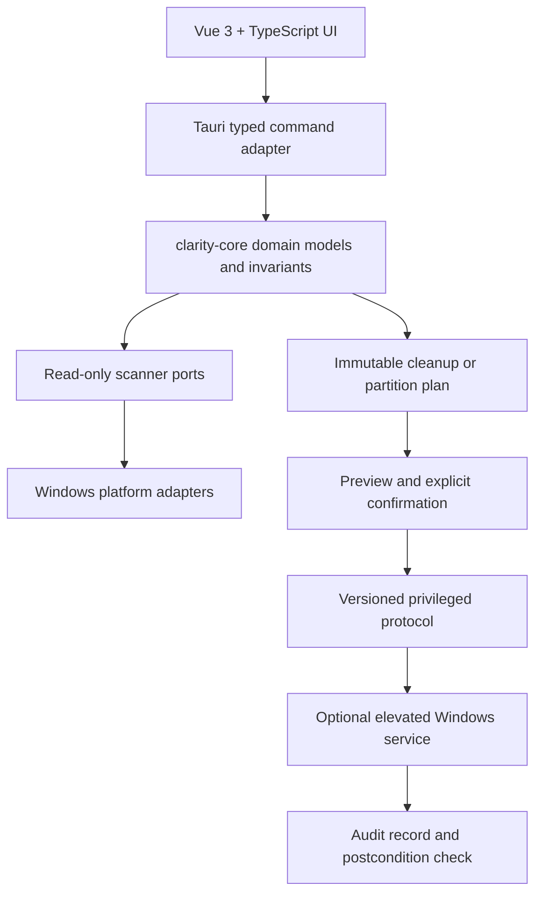
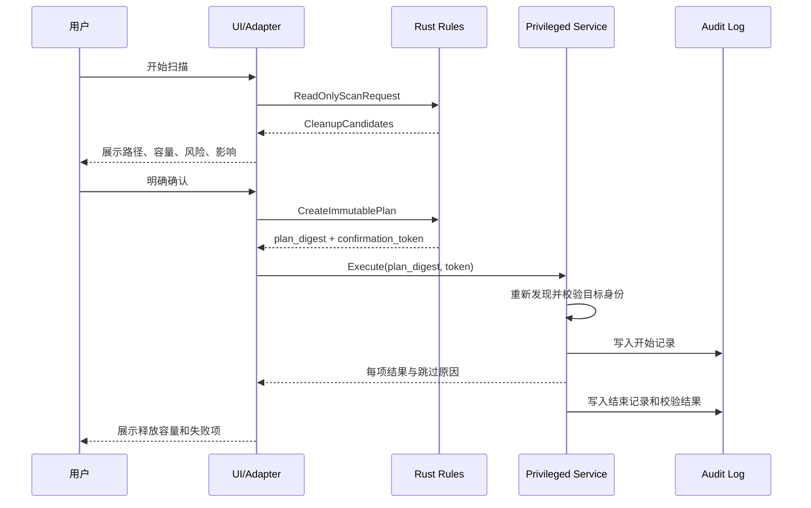

# 澄盘实现计划

> 文档版本：0.1 · 更新时间：2026-08-13 · 状态：待评审

这份文档用于在继续实现前统一产品范围、技术路线和安全边界。当前仓库已经完成 Rust workspace、Tauri + Vue 3 首页、GitHub CI/CD，以及 Windows 系统盘容量的只读发现；清理和分区写操作尚未开放。

## 1. 目标与非目标

### 目标

- 提供优雅、克制、接近 Apple 产品体验的 Windows 磁盘管家界面。
- 用 Rust 承担领域模型、扫描、规则引擎、操作计划和 Windows 平台适配。
- 用只读扫描建立可信数据，再由预览、确认、执行、校验和审计组成完整闭环。
- 将正式安装包和便携版限定在 GitHub Actions 的 Windows Runner 生成。
- 让普通用户可以安全清理系统垃圾，让高级用户能够预演分区调整风险。

### 非目标

- 第一阶段不实现任意路径递归删除。
- 第一阶段不实现 EFI、恢复分区、系统分区或 BitLocker 风险卷的写操作。
- 不接受任意 PowerShell、CMD 或 shell 字符串作为特权服务输入。
- 不承诺本地开发机生成安装包；本地只做质量检查和前端构建。

## 2. 产品分阶段路线

| 阶段              | 交付内容                                             | 写权限 | 完成标志                               |
| ----------------- | ---------------------------------------------------- | ------ | -------------------------------------- |
| P0 基础架构       | workspace、领域模型、首页、CI/CD、发布规范           | 无     | CI 全绿，首页可评审                    |
| P1 真实只读发现   | 系统盘容量、卷标、挂载点、多磁盘列表                 | 无     | Windows Runner 测试通过，异常可恢复    |
| P2 空间扫描       | 目录索引、文件类型统计、扫描进度、取消与限流         | 无     | 扫描结果可重复，路径越界测试通过       |
| P3 清理规则与预览 | 临时文件、浏览器缓存、回收站、缩略图、更新残留等规则 | 无     | 每条规则有风险级别、证据和预估容量     |
| P4 低风险清理     | 隔离区/回收站、官方 Windows 清理接口、一次性确认令牌 | 受限   | 只执行不可变计划，结果有审计记录       |
| P5 高级系统维护   | 休眠文件、更新缓存、还原点等需确认的系统项           | 受限   | 管理员服务协议、安全回滚和失败恢复完成 |
| P6 分区预演       | 分区拓扑、可移动空间、合并可行性检查、执行模拟       | 无     | 只读报告能解释每个阻塞原因             |
| P7 分区写操作     | 数据迁移、卷调整、重启恢复状态、回滚保护             | 高风险 | 经过独立安全评审后，以功能开关灰度发布 |
| P8 发布强化       | Authenticode 签名、安装升级、崩溃诊断、性能基线      | 依功能 | GitHub Release 可审计、可校验、可回滚  |

原则：每个阶段都必须能独立发布；没有完成安全前置条件时，后续危险能力保持不可见或只读。

## 3. 技术架构



### 模块职责

- `crates/clarity-core`：跨平台类型、容量校验、风险等级、扫描结果、操作计划和状态机；不得依赖 Tauri、Vue 或 Windows API。
- `apps/desktop/src-tauri/src/disk_discovery.rs`：只读系统卷发现；后续拆分为 `platform/windows/`，避免平台代码扩散到 command 层。
- `apps/desktop/src-tauri/src/commands/`：仅负责序列化、鉴权上下文、取消信号和错误映射，不做路径判断或业务决策。
- `apps/desktop/src/services/`：前端 typed invoke、加载状态、错误提示和浏览器 fixture 适配。
- `apps/desktop/src/components/`：展示组件；不直接访问文件系统，不拼接特权请求。
- `docs/`：架构决策、安全协议、发布流程、测试策略和变更记录。

## 4. 清理实现计划

### 4.1 只读发现

1. 枚举逻辑卷并绑定稳定卷标识，而不是只保存用户可修改的盘符。
2. 读取总容量、可用容量、文件系统、卷状态和 BitLocker 状态。
3. 扫描根目录时默认跳过符号链接、联接点、重解析点、虚拟文件和正在使用的系统目录。
4. 所有扫描任务支持取消、超时、低优先级和最大深度限制。
5. 结果带有 `scan_id`、时间戳、扫描范围、规则版本和不完整标记。

### 4.2 规则引擎

规则输出统一为 `CleanupCandidate`，至少包含：

- 稳定 `rule_id` 和版本号；
- 规范化路径或官方 API 标识；
- 字节数、文件数、可恢复性；
- `Safe`、`Review`、`ConfirmationRequired` 风险等级；
- 证据、跳过原因和用户可读说明；
- 默认是否选中以及是否允许进入隔离区。

首批规则按风险从低到高：浏览器缓存、缩略图缓存、临时目录、回收站、应用构建缓存、Windows 更新缓存、休眠文件。用户文档、下载目录、桌面、项目源码和未知扩展名默认不选中。

### 4.3 清理执行闭环



任何步骤失败都停止后续项目；不将“部分成功”伪装为成功。个人文件优先进入回收站或隔离区，系统项优先调用 Microsoft 官方接口。

## 5. 分区功能计划

分区能力必须晚于清理能力，并且先做只读预演：

1. 获取磁盘唯一标识、分区 GUID、起始偏移、容量、文件系统和在线状态。
2. 检查当前系统分区、EFI、恢复分区、动态磁盘、存储空间、BitLocker、快照和坏块状态。
3. 计算可移动空间和数据迁移需求，明确“为什么不能合并”，而不是只给出按钮。
4. 生成模拟后的分区拓扑和预计重启步骤。
5. 写操作必须使用枚举型协议，绑定计划摘要和一次性确认令牌。
6. 操作前重新扫描；任何卷身份、容量或安全状态变化都使计划失效。
7. 需要离线操作时，保存版本化恢复状态，重启后只能继续已确认的计划或安全停止。

默认禁止删除或改动 EFI、恢复、当前系统卷和存在加密/健康告警的卷。

## 6. UI 计划

- 首页：容量概览、智能扫描、可释放空间、磁盘健康和最近活动。
- 扫描页：阶段进度、当前目录、预计剩余时间、暂停/取消、扫描范围说明。
- 清理页：按风险分组的候选项、路径详情、容量排序、全选/反选和影响提示。
- 预览页：不可变计划摘要、释放空间、预计耗时、需要管理员权限的项目。
- 分区页：磁盘拓扑、可用空间、合并预演和阻塞原因。
- 历史页：扫描与清理记录、释放容量、失败项、恢复入口。
- 设置页：自动维护频率、忽略规则、隔离区保留期、隐私和日志选项。

视觉原则：深色优先、低饱和背景、清晰层级、克制动画、键盘可操作、状态颜色不只依赖颜色；危险操作使用明确的二次确认，而非误导性渐变按钮。

## 7. 质量与验收

### 每个功能必须具备

- Rust 公共 API 的 Rustdoc；TypeScript 导出项、Props、Emits 和 composable 的 JSDoc。
- 领域单元测试、平台适配测试、Tauri command 契约测试和关键 UI 测试。
- 正常、取消、超时、权限不足、路径变化、磁盘断开和部分失败用例。
- 不能越界、不能重复执行、不能使用过期令牌、不能执行空计划的安全测试。
- 性能指标：首页快速可交互；只读扫描可取消；内存和句柄随扫描结束释放。

### CI 门禁

```text
pnpm format:check
pnpm lint
pnpm typecheck
pnpm test
pnpm --filter @clarity-disk/desktop build:web
cargo fmt --all --check
cargo clippy --workspace --all-targets --locked -- -D warnings
cargo test --workspace --locked
```

本地不执行 `tauri build`。NSIS、便携版 ZIP 和 SHA-256 只由 GitHub Release workflow 生成；缓存命中时目标为几分钟完成，冷缓存耗时单独记录，不虚报稳定指标。

## 8. GitHub 发布计划

1. PR：只执行质量门禁，不生成安装包。
2. 合并到 `main`：保留可追踪提交和变更日志。
3. 创建 `vX.Y.Z` tag：Windows Runner 构建 NSIS 和 portable ZIP。
4. 上传 Draft Release、SHA-256 校验文件和变更说明。
5. 人工验证安装、卸载、升级、WebView2、签名和杀毒软件误报情况。
6. 发布后保留回滚版本，并监控崩溃、清理失败和分区预演失败指标。

## 9. 当前状态与下一步

当前已完成：P0 基础架构、首页、P1 多磁盘/多卷容量与基础健康状态的只读发现，以及 P3 浏览器缓存、缩略图缓存和用户临时目录的只读扫描与清理预览基础版；GitHub CI 已验证通过。

下一次实现建议：

1. 在 Windows Runner 上验证新增规则、路径边界和符号链接跳过测试。
2. 接入回收站和应用构建缓存规则，仍只生成预览。
3. 设计不可变清理计划、隔离区和二次确认协议，完成安全评审后再决定是否开放首个低风险清理动作。

任何涉及删除、管理员权限、分区写入或重启的实现，都必须先更新本计划和安全文档，再进入代码评审。
