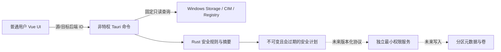
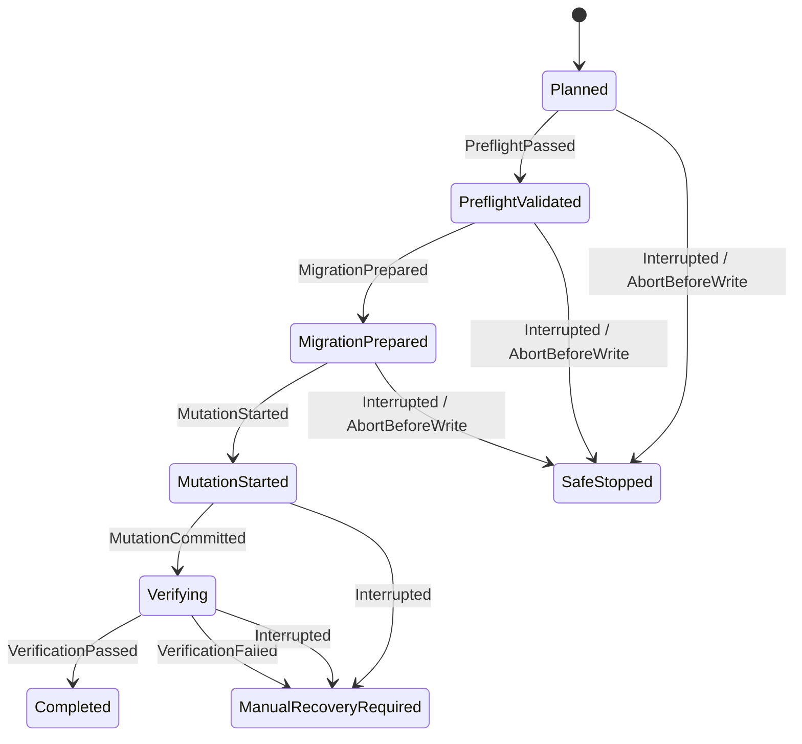

# 分区写操作威胁模型

> 版本：2.0 · 适用范围：分区安全评估与受控执行 · 当前写入能力：已实现、双门禁关闭

## 1. 安全结论

受控执行已实现独立一次性管理员代理、真实迁移/删除/扩展适配器和恢复日志。普通评估仍固定为未授权；执行挑战只在不可变计划 v2、独立备份、全部新鲜证据以及编译/管理员运行时双门禁同时通过时签发。当前独立备份提供程序仍返回不可用，因此默认产品不会到达写入边界。

任何后续写入实现必须重新接受本威胁模型评审，不能把“安全基础就绪”解释为执行授权。

## 2. 保护资产

- 当前系统、EFI、恢复和用户数据分区的可启动性与完整性；
- 源分区待迁移文件和目标分区原有数据；
- 物理磁盘、分区 GUID、偏移、容量和拓扑身份；
- 不可变计划摘要、恢复日志和审计记录；
- BitLocker、VSS、健康、供电、待重启和备份证据；
- 用户对“预演、计划、确认、执行”四个阶段的准确理解。

## 3. 信任边界

`PLAN` 到 `PRIV` 现在只有版本化、一次性、摘要绑定的枚举协议；普通浏览器没有该边，Tauri 主进程不会整体提权。

## 4. 主要威胁与控制

| 威胁                           | 可能后果                     | 当前控制                                                    | 后续写入门槛                                     |
| ------------------------------ | ---------------------------- | ----------------------------------------------------------- | ------------------------------------------------ |
| UI 伪造盘符、路径、GUID 或偏移 | 修改错误目标                 | UI 只提交后端分区 ID；后端重新发现                          | 特权服务必须再次独立发现并比对全部身份           |
| 拓扑在预演后变化               | 计划指向过期布局             | 计划绑定拓扑时间和预演摘要，证据窗口 60 秒，计划 5 分钟过期 | 执行前最后一次原子预检，任何变化使计划失效       |
| 任意命令或参数注入             | 获得通用管理员执行能力       | 固定 PowerShell 脚本、受信任系统路径、无调用方脚本/路径     | 特权协议只接受枚举和有界数值，禁止 shell         |
| 误把未知状态当安全             | 在加密、坏盘或状态不明时写入 | 未知健康、介质、BitLocker、VSS、供电、重启或备份均失败关闭  | 不允许“忽略并继续”开关                           |
| 仅靠用户勾选声称已有备份       | 数据不可恢复                 | 当前备份证据固定不可用，普通勾选不算验证                    | 独立提供程序验证其他物理设备上的可恢复备份       |
| 电池耗尽或供电中断             | 元数据写入中断、卷损坏       | 读取系统电池状态；电池放电或未知时阻塞                      | 关键设备提示 UPS；写入阶段设计最小不可中断窗口   |
| Windows 更新待重启             | 卷占用和系统状态变化         | 固定读取 CBS、Windows Update 和文件重命名标记               | 重启后重新生成全部证据和计划                     |
| 令牌重放或跨计划使用           | 重复或错误执行               | 当前没有执行令牌                                            | 一次性、短期、绑定计划摘要与进程会话，提交即消费 |
| 进程崩溃、断电或磁盘断开       | 不知道应继续还是停止         | 版本化恢复状态机和故障注入单元测试                          | 写入前持久化并强制刷新日志；启动只恢复同一摘要   |
| 写后验证失败                   | 隐性数据损坏                 | 状态机进入 `ManualRecoveryRequired`，禁止自动猜测           | 校验迁移内容、卷容量、文件系统与启动状态         |
| 日志泄露敏感身份               | 暴露设备或用户数据           | 计划只保存稳定后端 ID 和摘要，不保存文件内容                | 审计继续脱敏并限定保留期                         |

## 5. 恢复状态机

规则：元数据写入前可以安全停止；一旦 `MutationStarted`，中断或验证失败必须要求人工恢复，不能自动重试、回滚或选择另一个计划。

## 6. 故障注入矩阵

| 注入点                   | 期望状态                 | 自动继续 |
| ------------------------ | ------------------------ | -------- |
| 计划生成后               | `SafeStopped`            | 否       |
| 新鲜预检后               | `SafeStopped`            | 否       |
| 迁移准备后、元数据写入前 | `SafeStopped`            | 否       |
| 元数据写入开始后         | `ManualRecoveryRequired` | 否       |
| 写入完成、后置验证中     | `ManualRecoveryRequired` | 否       |
| 后置验证失败             | `ManualRecoveryRequired` | 否       |

领域测试覆盖合法顺序、越序事件、时间回退以及写入前后中断。真实写入实现还必须加入进程终止、系统重启、设备拔出、I/O 超时、容量变化和校验失败的 Windows 集成测试。

## 7. 上线证据门槛

工程已经提供独立备份凭据验证、异地恢复摘要工具、可销毁 VHDX 实验工作流、Authenticode 强制发布和灰度门禁。部署仍必须为每次启用提供实际证据：

- 当前源磁盘的管理员保护恢复凭据仍在有效期内；
- 对应 Windows、控制器和存储类型已在专用实验机完成故障演练并留存记录；
- Release 桌面程序、管理员代理和安装包由受信任生产发布者签名；
- 安全评审批准该版本，管理员运行时标志仅在批准设备开启。

缺少任何实际部署证据时，产品不会签发分区执行挑战，也不会到达元数据写入边界。代码完成不能替代恢复和签名事实。
